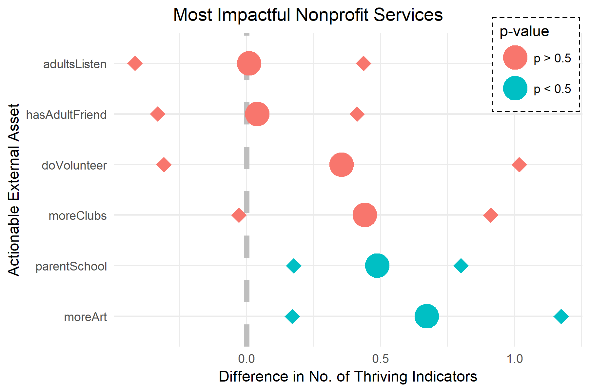

# Developmental Assets for Middlesex Youth

This is an analysis of the external factors - intensity of familial support, safety of neighborhoods, presence of youth programs, etc. - that impact the development of youth in order to generate hypotheses on which factors make the most positive impact.

*The research question is:* How do the presence of developmental assets provided for youth by the community affect youth outcomes in Middlefield and Deep River?

👉 [See my presentation here](https://docs.google.com/presentation/d/12u9zwlJS0NGWuW4Cp419TKtWGUNafRbr2FHAbzKmS4c/edit?usp=sharing)


# Statistical Technique: Propensity Matching


Since, we are using observational data, we need to account for the lack of the randomization of the data necessary to perform a reliable t-test. We do this by with a technique called propensity matching that will use matching variables to find a pair of observations that are as similar as possible except for the treatment variable. 

Having paired observations allows us to make conclusions (with a level of statistical confidence) about the effects of the treatment variable.

# Summary of findings



Using a data set that surveyed youth in the 7th - 12th grade for the internal & external developmental assets available to them and indicators of them thriving, this research attempted to find most impactful actionable external assets that nonprofits can focus on. **Two external assets were found to be most impactful**: 

* Parent involvement in school (`parentSchool`): youth's parents often to very often attend meetings in school

* Creative activities (`moreArt`): youth spends 3+ hours of free time learning music, art, drama, dance

The results of this research will be presented to CFMC and DMFYS in order to inform the programs that they will fund and implement moving forward. A majority of DMFYS's programs already focus on parent involvement and creative activities. A quick look at their website reveals a "proactive parenting" workshop series and "F.U.N. nights" which includes dancing/arts & crafts. This will serve as validation for the work they are doing. (Coincidentally, DMFYS is of the most longstanding relationship that CFMC has.) 


# Usage
### Viewing Complete Report

1. Download github repository into a .zip file
2. Extract folder
3. Open `corpuz-qac-final.html` on a browser of your choice where you'll find: 
    * Code for data management, analysis and graphics creation
    * Rendered graphs on data exploration and summarization of findings

### Running code
```
git clone https://github.com/fredcorpuz06/dev-assets-youth.git
cd dev-assets-youth
```
Open `corpuz-qac-final.Rmd` file and/or `/scripts/*.R` in RStudio. Note that confidential data from DMFYS was not uploaded unto Github. 

# Report Breakdown
* Introduction
    * Research Question
    * Motivation
* Methods
    * Data description
    * Procedures
    * Measures: matching, treatment and response variables
* Data munging
    * Declaring variables
    * Data management
    * Data exploration
    * Determining cut-off points (binary split for treatment variables)
* Data analysis (effect estimation)
    * Matching 
    * Interpretation
* Discussion
    * Implication of findings
    * Suggestions for future research

# Authors
* Frederick Corpuz
* Thayer Talbott
